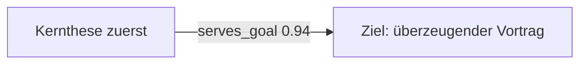

# Mermaid Knowledge Map Renderer

## Zweck

Erzeuge aus einem bestehenden Graphvertrag eine portable Mermaid-Darstellung. Der Renderer entscheidet über Darstellung, nicht über fachliche Beziehungen.

## Modi

### `flowchart`
Standard für komplexe Graphen mit Querverbindungen, Abhängigkeiten und Widersprüchen.

### `mindmap`
Nur verwenden, wenn der Graph sinnvoll auf einen eindeutigen Root-Knoten oder ein Root-Thema projiziert werden kann. Cross-links, die Mermaid Mindmap nicht sauber ausdrückt, müssen separat als Link-Legende erhalten bleiben oder zum `flowchart`-Modus führen.

## Workflow

1. Referenzielle Integrität des Eingabegraphen prüfen.
2. Sichere Mermaid-IDs aus stabilen Node-IDs erzeugen; Original-ID in Label oder Kommentar erhalten.
3. Labels escapen und auf lesbare Länge kürzen, ohne den Knoteninhalt semantisch umzuschreiben.
4. Edge-Typen als Labels darstellen.
5. Unsichere/inferierte Beziehungen sichtbar kennzeichnen, z. B. durch Edge-Label `supports ? (0.72)`; keine Confidence verstecken.
6. Cluster optional als `subgraph` rendern.
7. Bei mehr als etwa 40 sichtbaren Nodes zusätzlich eine reduzierte Themenansicht empfehlen oder erzeugen; der Vollgraph bleibt erhalten.
8. Mermaid-Syntax auf geschlossene Klammern, eindeutige IDs und bekannte Edge-Ziele prüfen.

## Beispiel

## Regeln

- Keine neue Edge nur für ein schöneres Layout.
- `contradicts`, `blocks` und offene Fragen nicht ausblenden.
- Clustergrenzen sind Darstellung, sofern sie nicht im Quellgraph ausdrücklich semantisch definiert sind.
- Ein großer unlesbarer Graph ist kein Erfolg: zusätzlich eine gefilterte View erzeugen, aber niemals anstelle des vollständigen Graphen.

## Abschluss

Der Skill endet mit syntaktisch plausibler Mermaid-Ausgabe, deren Nodes und Edges auf den Eingabegraphen zurückgeführt werden können.
